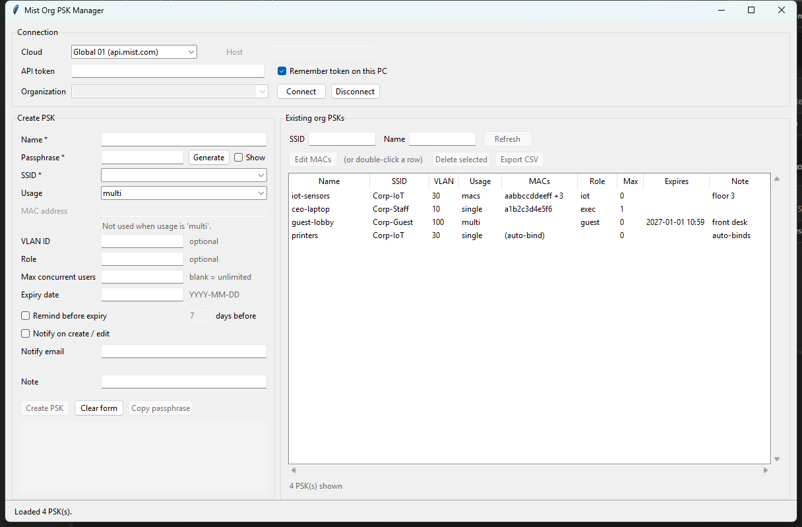
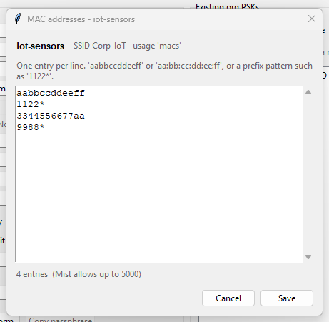

# MyMistPSKApp

A small cross-platform desktop app for creating and managing
**organization-level PSKs** in Juniper Mist, using the Mist REST API.
Runs on Windows, macOS and Linux.



## What it does

- Connect to any Mist cloud region with an API token
- Pick an organization from the ones your token can see
- Create an org PSK: name, passphrase, SSID, usage mode, VLAN, role, max
  concurrent users, expiry, and notification settings
- Generate a strong passphrase (no ambiguous `0/O/1/l/I` characters)
- List existing org PSKs, filter by SSID or name, sort by any column
- See the bound clients in a **MACs** column, and edit that list in place
- Delete selected PSKs (with a confirmation prompt)
- Export the current list to CSV

## Install

Python 3.9 or newer, with Tkinter.

```
pip install -r requirements.txt
```

**Windows** — Tkinter ships with the python.org installer; nothing extra needed.

**macOS** — the Python bundled with macOS does not include a usable Tk. Install
one that does:

```
brew install python-tk        # if you use Homebrew Python
```

or install Python from [python.org](https://www.python.org/downloads/), which
bundles Tk. Check with `python3 -c "import tkinter"`.

**Linux** — `sudo apt install python3-tk` (or your distribution's equivalent).

## Run

| Platform | How |
| --- | --- |
| Windows | Double-click `run.bat`, or `python app.py` |
| macOS | Double-click `run.command`, or `python3 app.py` |
| Linux | `./run.command`, or `python3 app.py` |

If `run.command` will not launch from Finder, make it executable once:
`chmod +x run.command`.

## Getting an API token

In the Mist dashboard: your account menu (top right) → **My Account** →
**API Tokens** → **Create Token**.

The token inherits your own privileges, so it can only touch orgs you already
have access to. Creating PSKs requires at least Network Admin rights on the org.

## Fields

| Field | Notes |
| --- | --- |
| **Name** | Required. The PSK's display name in Mist. |
| **Passphrase** | Required. 8–63 characters, or exactly 64 hex characters. |
| **SSID** | Required. The dropdown is filled from the org's WLAN templates; you can also type an SSID that isn't listed. |
| **Usage** | `multi` (shared), `single` (bound to one MAC), `macs` (a list of MACs or patterns like `1122*`), `usermac_labels` (labels such as `iot`). |
| **VLAN ID** | Optional. Numeric. |
| **Role** | Optional. Up to 32 characters. |
| **Max concurrent users** | Blank means unlimited (Mist's default of `0`). |
| **Expiry date** | `YYYY-MM-DD`. The PSK expires at 23:59:59 local time on that day. Blank means it never expires. |
| **Remind before expiry** | Needs an expiry date. |
| **Notify on create / edit** | No extra fields required. |
| **Notify email** | Always optional, matching the API. If a notify box is ticked with no email, the form shows a hint that Mist may have nowhere to send the notice, but the PSK is still created. |

### After a successful create

The form empties completely and the cursor returns to **Name**, so the next key
can be typed straight away. The PSK list refreshes automatically.

The passphrase you just issued stays in the box at the bottom of the form, with a
**Copy passphrase** button, and survives the clearing. The PSK list does not show
passphrases, so copy it before you create the next key — the next create replaces
what is in that box.

**Clear form** does the same reset but also wipes the result box.

## Editing the MAC list

The **MACs** column summarises the clients a PSK is bound to: the single entry
if there is one, otherwise the first plus a count (`aabbccddeeff +3`). PSKs with
usage `multi` are not client-bound, so the cell is blank.

Double-click a row (or select it and press **Edit MACs**) to open the list in a
small editor, one entry per line.


 Add a line, delete a line, paste a block —
then **Save**. Accepted forms:

- `aabbccddeeff`, `aa:bb:cc:dd:ee:ff`, `aa-bb-cc-dd-ee-ff`, `aabb.ccdd.eeff`
  (all normalised to the first form)
- prefix patterns such as `1122*`
- for usage `usermac_labels`, plain labels like `iot`, kept exactly as typed

Duplicates are collapsed. Mist's caps are enforced: 5000 MACs, 100 labels, and
one MAC for usage `single` (clearing it means auto-bind on first use).

### The passphrase caveat

Mist's update endpoint requires `name`, `passphrase` and `ssid` on every PUT,
even when only the MAC list changes. So:

- **If the API returns the existing passphrase**, the editor round-trips it and
  your save changes nothing but the client list.
- **If it does not**, the editor says so and asks for a passphrase, warning that
  saving will *set* it and disconnect clients still using the old one. It also
  asks you to confirm before sending.

Which of these you get depends on your org, and the app handles both. The first
MAC edit you make will show you which one applies.

## Where settings are stored

Cloud region, selected org, and (if "Remember token on this PC" is ticked) the
API token:

| Platform | Path |
| --- | --- |
| Windows | `%LOCALAPPDATA%\MyMistPSKApp\config.json` |
| macOS | `~/Library/Application Support/MyMistPSKApp/config.json` |
| Linux | `$XDG_CONFIG_HOME/MyMistPSKApp/config.json` (default `~/.config/...`) |

**The token is stored in cleartext.** That was a deliberate choice for
convenience. It means any program running as your user account can read it.

The file is written with `chmod 0600`. On macOS and Linux that genuinely limits
it to your account. **On Windows it does not** — there it only toggles the
read-only flag, leaving the inherited ACL in place.

If that isn't acceptable:

- Untick **Remember token on this PC** and paste the token at each launch, or
- Delete the config file when you're done.

Rotate or delete the token in the Mist dashboard if you think it has leaked.

## Cloud regions

The dropdown covers the published Mist clouds (Global 01–05, EMEA 01–04,
APAC 01–03). If yours isn't listed, choose **Custom host...** and enter the API
hostname. Use the host that matches your org — a token from one cloud will not
authenticate against another.

## Files

| File | Purpose |
| --- | --- |
| `app.py` | Tkinter UI and form logic |
| `mist_api.py` | Mist REST client: auth, pagination, error handling |
| `settings.py` | Local config load/save |
| `run.bat` | Windows launcher |
| `run.command` | macOS / Linux launcher |

## API endpoints used

| Call | Endpoint |
| --- | --- |
| Identity and org list | `GET /api/v1/self` |
| SSIDs for the dropdown | `GET /api/v1/orgs/{org_id}/wlans` |
| List PSKs | `GET /api/v1/orgs/{org_id}/psks` |
| Re-read one PSK before an edit | `GET /api/v1/orgs/{org_id}/psks/{psk_id}` |
| Create PSK | `POST /api/v1/orgs/{org_id}/psks` |
| Update a PSK's client list | `PUT /api/v1/orgs/{org_id}/psks/{psk_id}` |
| Delete PSKs | `POST /api/v1/orgs/{org_id}/psks/delete` |

Requests authenticate with the `Authorization: Token <api-token>` header.

## How this was verified

The request and response shapes come from Juniper's published OpenAPI spec
(`mistsys/mist_openapi`), not from memory. The UI and the API client were
exercised against a stubbed HTTP transport — roughly 70 checks covering payload
building, validation, pagination, error handling and the MAC editor — so no
live org was touched during development.

Development and the screenshots were done on Windows. The platform-specific
code is the config directory, which is unit-checked for all three platforms, and
the launcher scripts. The rest is plain Tkinter, but **the macOS build has not
been run on a Mac** — expect to iron out minor spacing if anything looks off.

Two paths are therefore unproven until you run them against a real org:

1. **Creating and deleting PSKs.** Verified in shape, not end to end.
2. **Saving a MAC list.** See the passphrase caveat above; which branch applies
   depends on whether your org's API returns existing passphrases.

## Limitations

- Creates org-level PSKs only, not site-level ones
  (`/api/v1/sites/{site_id}/psks`).
- Editing is limited to the MAC / label list. Other fields on an existing PSK
  (VLAN, role, expiry) are create-and-delete only.
- No bulk import from CSV. Mist has a `POST .../psks/import` endpoint if that
  becomes useful.
